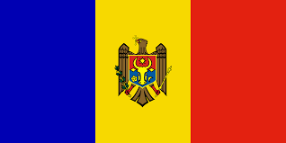
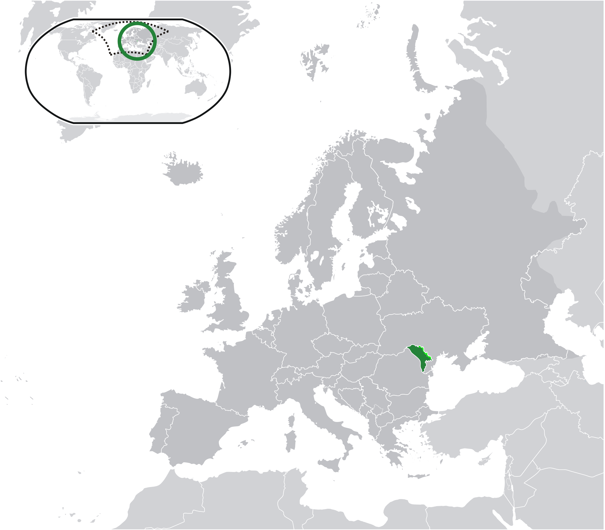
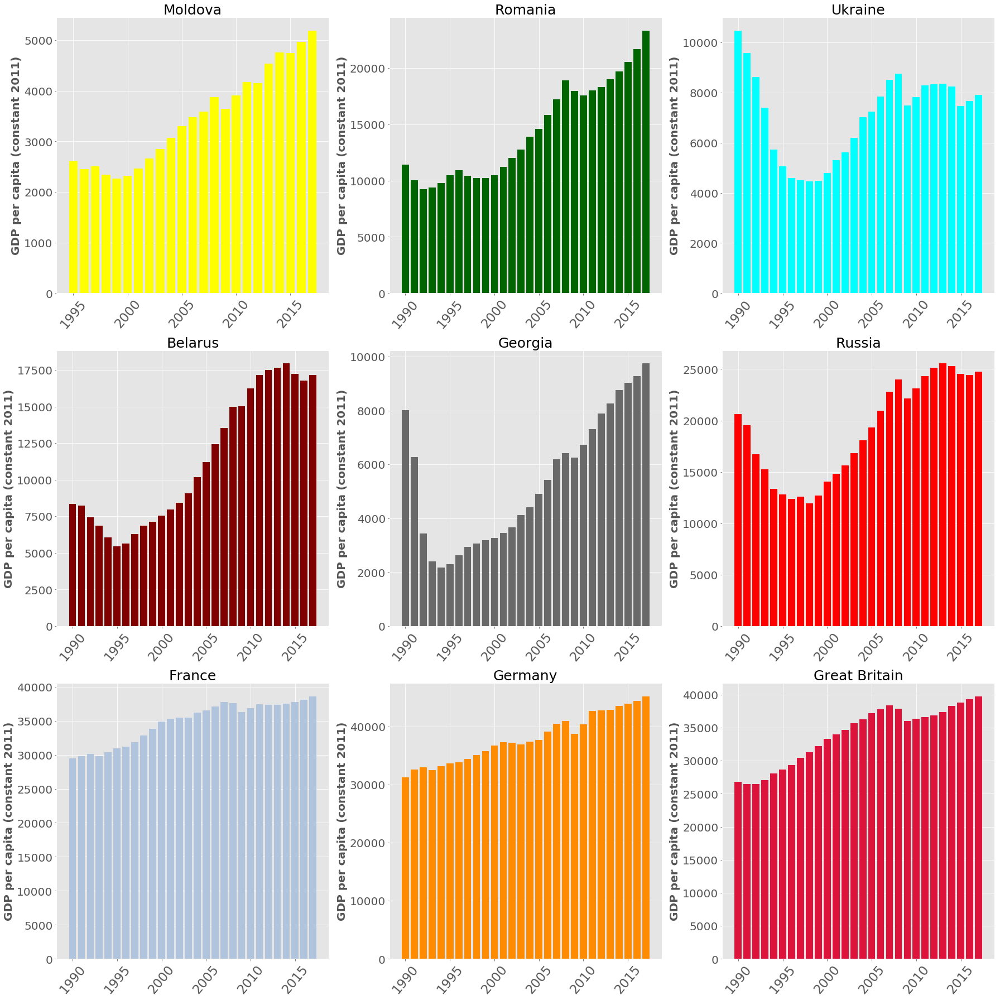
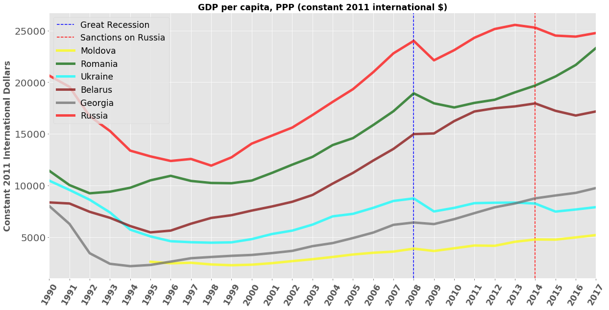
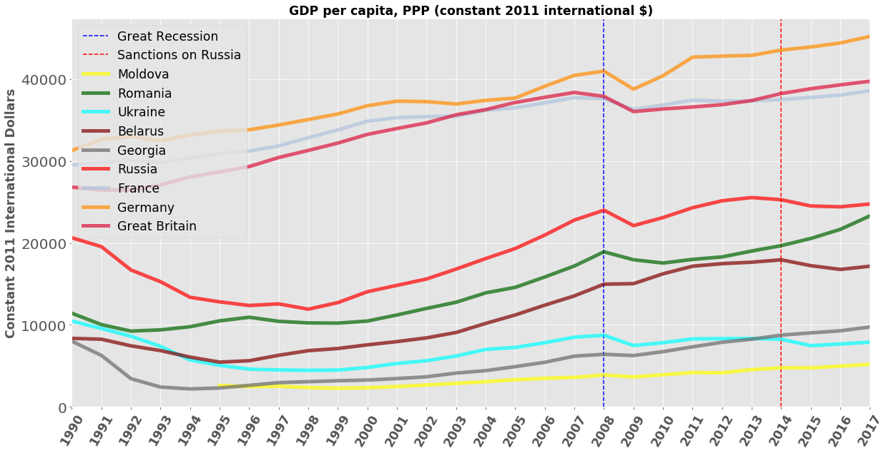
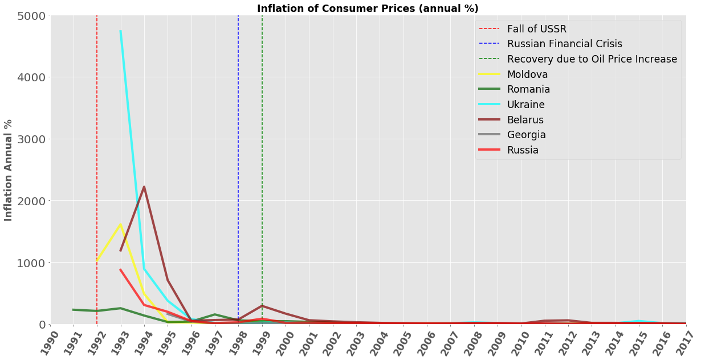
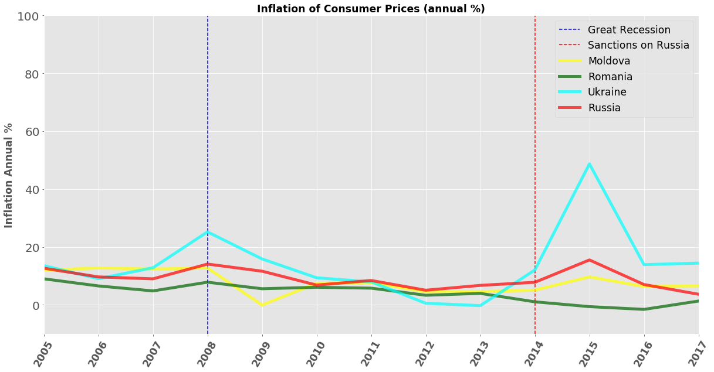
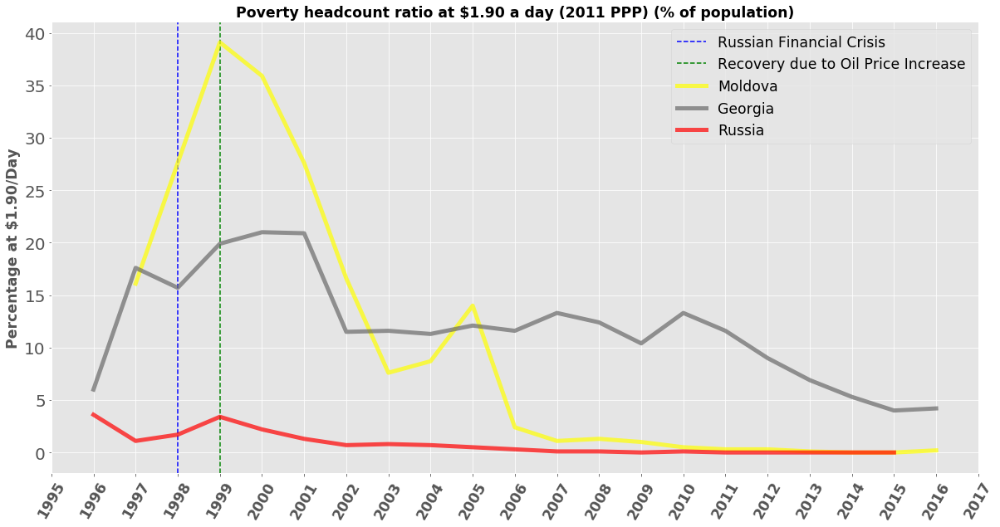
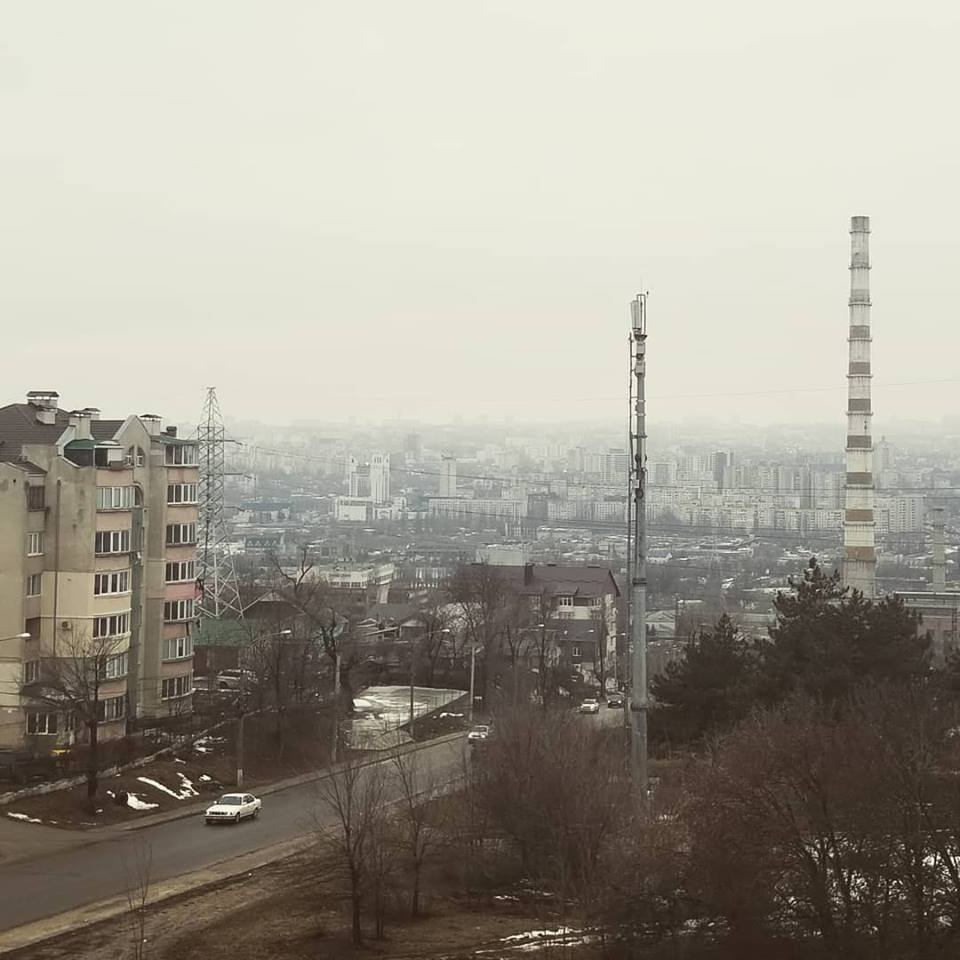

 # Republic of Moldova Economic Situation

 ## Background and Motivation
 The Republic of Moldova is a landlocked country in Eastern Europe bordered by Romania to the west and Ukraine to the north,east, and south. Moldova is also the <a href="https://www.jagranjosh.com/general-knowledge/top-10-poorest-countries-in-europe-1538044990-1">poorest country in Europe</a>, as well as the country with the lowest  <a href=https://en.wikipedia.org/wiki/Human_Development_Index> Human Development Index</a>. The territory of Moldova 
has changed hands often throughout history. Most recently, during the dissolution of the Soviet Union, Moldova declared independence on 27 August 1991. Like many former Soviet countries, the fall of the USSR ushered in a period of economic and civil unrest. I'm interested in Moldova because it was my last deployment as a soldier. I was there during a period leading up to an election, and political opinions <a href=https://en.wikipedia.org/wiki/2019_Moldovan_constitutional_crisis> starkly varied </a> between pro Western and pro Russian candidates. I wanted to see what type of economic effect Russia has had on Moldova since the breakup of the Soviet Union on Moldova. 
## The Data
The dataset's were collected from <a href=https://data.humdata.org/>humdata.org</a>, a website with a wide variety of humanitarian data. The data contains information about twenty eight economic and social indicators, gathered from World Bank's data portal. I collected this information about Moldova and it's neighboring countries, as well as a few larger European economies. Specifically Moldova, Romania, Ukraine, Belarus, Georgia, Russia, Germany, France, and Great Britain. Some of the indicators had information back to 1960, however, there were many incomplete columns and data beginning in the 90's were more common. Luckily however, each dataset was formatted the same, allowing me to apply the same pipeline I used on the Moldova dataset to all others. Originally, the indicators were all in one column, I pivoted the data to make each indicator name it's own column.  
## Exploratory Data Analysis
The first indicator I looked at was Gross Domestic Product <a href=https://en.wikipedia.org/wiki/Gross_domestic_product>(GDP)</a> per capita in <a href=https://en.wikipedia.org/wiki/International_United_States_dollar>international dollars</a>. For all countries but Moldova this was available since 1990. For Moldova it was available beginning in 1995. Besides Romania, the prior Soviet countries experienced significant declines in GDP in the 90's, followed by steady economic growth. The recession of 2008 is also visible for all countries. 

I wanted to see this information on the same plot, to see how Russia's neighbor's economies behaved in relation to Russia. Again, the effect of the recession of 2008 is visible. In addition, there is a visible downturn following international sanctions on Russia following the <a href=https://en.wikipedia.org/wiki/Annexation_of_Crimea_by_the_Russian_Federation>annexation of Crimea</a>. However, this effect is only seen on Russia, Belarus, and Ukraine, while Moldova, Georgia, and Romania appear to have largely avoided it. 

Now adding the large economies:

Next I wanted to visualize currency inflation of the former Soviet countries following the collapse. All the available data is plotted. You can see annual inflation approach 2000% for Moldova and Ukraine's data beginning at near 5000%. I was curious about the inflation spikes that are visible in 1998. As indicated, there was a <a href=https://en.wikipedia.org/wiki/1998_Russian_financial_crisis> Russian financial crisis</a> in 1998. However, there was a quick recovery in 1999 largely due to an increase in oil prices. 

I wanted to get a closer look at the inflation spike barely visible for Belarus in the 2000's. Here, you can see some effects that the international sanctions on Russia had on the region:

Finally, I wanted to observe the poverty ratio. This is measured as the percentage of people living at or below the equivalent of $1.90 per day. Unfortunately much of this information was incomplete, but there was some data showing the effect of the aforementioned Russian financial crisis and subsequent recovery. You can see the relatively minor effect this had on the Russian poverty ratio but the large effect it had on Moldova. Other neighboring countries are removed due to lack of data. 

## Conclusions

Clearly, the economies of the former Soviet Union are intertwined. However, not all effects are experienced equally for all countries. Due to it's small size and poverty, I predicted the indicators for Moldova to show an exaggerated effect compared to Russia. Sometimes this was the case, and others it was not. When the Russian economy suffered due to sanctions, Moldova's showed only a small negative effect. In addition, Romania seemed completely immune to negative effects on the Russian economy for the indicators observed. This could be due to Romania <a href=https://en.wikipedia.org/wiki/Romania> favoring the EU</a> since the end of the Cold War. Attitudes in Moldova seem to increasingly favor the West over Russia, with pro-European parties winning 57 of the 101 seats in Congress in the recent election. It would be interesting in the future to see if pro-Western attitudes help Moldova's economy behave more like Romania's than Ukraine's.

